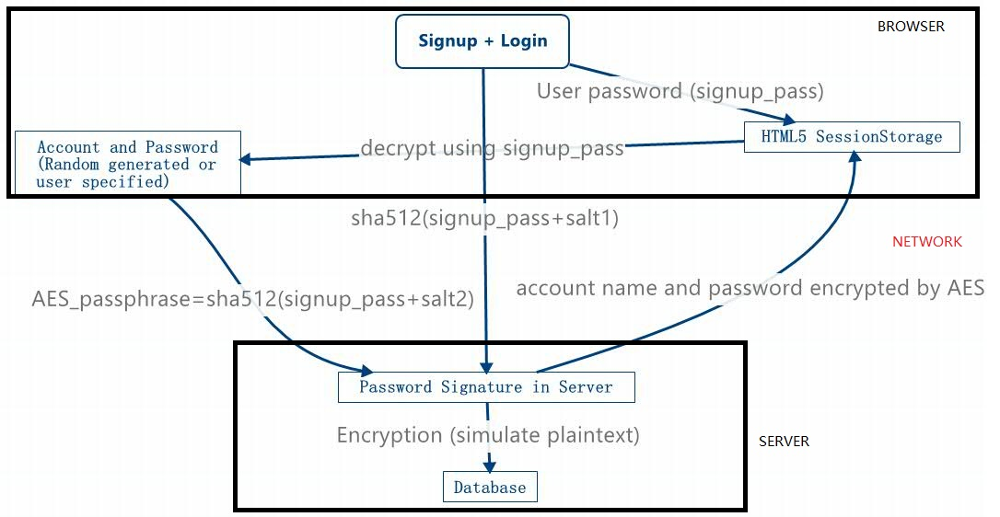

# Password Manager
##Version
v3.6  
##DEMO  
TO BE ADDED LATER.  
##Specification
This password manager can generate and store random strong passwords for users. Passwords are generated on users' browsers and then encrypted using AES256.  
SHA512 algorithm is used for user identification check  
Secret key (related to password) will not be uploaded to server.  

## How to Use
+ Install PHP, MySQL and WebServer(IIS, Apache or Nginx) in your server.  
+ Create a database in your MySQL server for this password manager.  
+ Import ``initial.sql`` into that database.  
+ Download ``src`` folder in this repository, modify ``src/function/config.php`` with your configuration (database and etc.)  
+ Upload files in modified ``src`` folder to your web server.  
+ Visit www.your_domain_name.com  
+ Click Signup to register an account. (If you don't want others to sign up, just delete signup.php and reg.php after you are done)  
+ You are done! SSL is optional (It's secure enough)  
+ Remember your password to login. No one can recover your data if you lose that!  
  
## Copyright  
Jeffery Zhao    
The copyright for Crypto-JS and Bootstrap are reserved by their authors.  
## Licence  
MIT  
